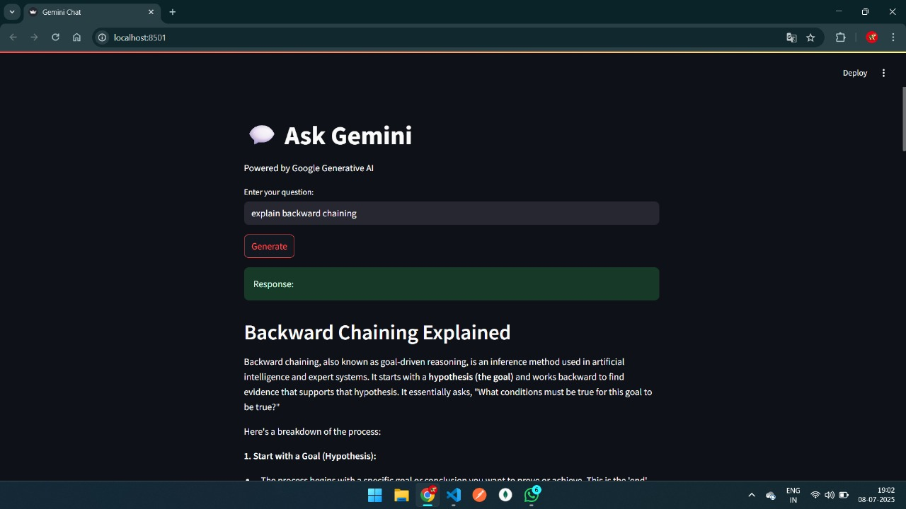

# 💬 Gemini PDF Chatbot — Ask Questions & Save Responses as PDF

This project is a **Streamlit-based chatbot** powered by **Google's Gemini API** (via Generative AI), which lets users:
- Ask any question
- Get AI-generated responses
- Save the chat as a downloadable **PDF**


---

## 🖼️ Working Screenshot

<p align="center">
  
</p>

---

## 🚀 Features

- 🧠 Ask anything using Google Gemini (Flash 2.0)
- 📄 Automatically generate and download PDF responses
- 🔐 Secures your API key via `.env` file
- ⚡ Simple and fast UI using Streamlit

---

## 🛠️ Tech Stack

- **Python**
- **Streamlit**
- **Google Generative AI (Gemini 2.0 Flash)**
- **FPDF** (for PDF generation)
- **dotenv** (for secure API key management)

---

## 🗂️ Project Structure

```
gemini-pdf-chatbot/
│
├── app.py                 # Main Streamlit app
├── .env                   # Stores your API key
├── requirements.txt       # Python dependencies
└── README.md              # This file
```

---

## 🔧 Setup & Installation

1. **Clone the repository**  
   ```bash
   git clone https://github.com/yourusername/gemini-pdf-chatbot.git
   cd gemini-pdf-chatbot
   ```

2. **Create a virtual environment and activate it**
   ```bash
   python -m venv .venv
   .venv\Scripts\activate       # Windows
   # source .venv/bin/activate    # macOS/Linux
   ```

3. **Install dependencies**
   ```bash
   pip install -r requirements.txt
   ```

4. **Create a .env file and add your Gemini API Key**
   ```ini
   API_KEY=your_google_generative_ai_api_key
   ```

5. **Run the app**
   ```bash
   streamlit run app.py
   ```

---

## 📄 Example Use

1. Type your question like:
   ```
   Explain Quantum Computing in simple terms.
   ```

2. Click **Generate**

3. Get an instant answer from Gemini

4. Download the response as a formatted PDF

---

## 🔐 Important Note

Never commit your `.env` file to public repositories.

Add `.env` to `.gitignore` like this:
```
.env
```

---

## 📜 License

This project is licensed under the MIT License.

---

## 🤝 Contributions

Feel free to fork the repo, raise issues, or suggest new features via pull requests.

---

## ✨ Author

Developed by **Pandala Shiva** | [GitHub](https://github.com/ShivaNetha1)
